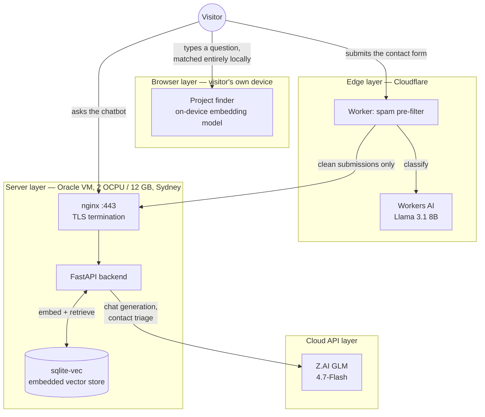

# Architecture

This site answers one question about its own design: **where should an AI feature actually run?**
Instead of picking one answer, it deliberately runs inference in four different places, each for a
different reason, each accepting a different trade-off. The rest of this document walks through
each one — what it does, why it lives where it lives, and what it cost to get right.

If you're new to some of these terms: **RAG** (Retrieval-Augmented Generation) means looking up
relevant text first, then handing that text to a language model as context, so the model answers
from real facts instead of whatever it happens to remember. An **OCPU** (Oracle Compute Unit) is
roughly one physical CPU core. **On-device** means the model runs on the visitor's own hardware —
their browser or their phone — rather than on a server, so nothing about their question ever
leaves their machine.

---

## The shape of a request

Four boxes, four different reasons to be there. The rest of this document is that reasoning,
layer by layer.

---

## Browser — matching a question to real work, on the visitor's own device

**File:** `web/src/project-finder.ts`

Type a question like "has he worked with real-time data?" into the project finder, and it doesn't
generate an answer — it finds the one existing project card on the page that best matches, and
highlights it. No text is invented; nothing leaves the browser.

Mechanically: the widget reads the project cards already rendered on the page (`readProjects()`),
so there is no separate copy to keep in sync with what a visitor actually sees. On first use, it
lazily downloads a small embedding model — `onnx-community/all-MiniLM-L6-v2-ONNX`, run via
[transformers.js](https://github.com/huggingface/transformers.js) — showing real download progress
rather than a generic spinner. It then embeds every project's text and the visitor's question with
that same model, and ranks projects by cosine similarity (a standard way to measure how close two
pieces of text are in meaning, not just in wording). The closest project wins. Later matches reuse
the already-loaded model, so only the first one pays the download cost.

**Why retrieval, not generation.** An earlier version let the on-device model generate a free-text
answer about the visitor's question. It occasionally invented details — a plausible-sounding but
fabricated employer or project fact. A model small enough to run in a browser tab is not one you
can trust to freely narrate a career; retrieval-and-point-at-the-real-thing has no way to
fabricate, because it never writes new text at all (decision 44). This is also why the widget
always runs on WASM rather than trying WebGPU first: an earlier attempt (decision 43) branched on
`navigator.gpu`'s mere presence and found that doesn't mean a working WebGPU adapter exists; an
encoder-only model this small is cheap enough on WASM alone that the extra code path wasn't worth
keeping.

If the model download fails or is cancelled, the widget says so honestly — "Cancelled — nothing
was kept," or "Couldn't run the model" — and never silently falls back to asking the backend
instead. That distinction is the whole point of this layer: it either works entirely on-device, or
it visibly doesn't.

---

## Edge — deciding what's spam before it reaches anything expensive

**Files:** `edge/src/index.ts`, `edge/src/classify.ts`

Every contact-form submission passes three gates here, ordered by what they cost: local field
validation is free, a **Turnstile** check is a fast network round trip, and the spam classifier
costs inference. Nothing expensive runs behind something cheap that would have rejected the request
anyway.

**Turnstile** (decision 69) proves a browser with a human behind it sent the form — no cookies, no
fingerprinting, no personal data. The widget on the page is not the protection; anything can POST
straight at the Worker, so the token is verified server-side here, against Cloudflare's siteverify
endpoint, and dropped rather than forwarded. The backend never sees it.

It is also where the fail-open rule gets interesting. `edge/CLAUDE.md` says forward rather than drop
when a check errors, because a swallowed job enquiry is the failure this project cannot afford — but
a security gate that passes everything when it breaks is not a gate. The resolution is to separate
*the client failed the check* (no token, replayed, minted for another site → refuse) from *we could
not run the check* (Cloudflare unreachable → forward, and log loudly). An attacker cannot choose the
second branch, and both remaining gates still sit behind it.

Submissions that clear Turnstile are then validated and classified by a small model running on
**Cloudflare Workers AI** — `@cf/meta/llama-3.1-8b-fast-v2`
— as either a genuine enquiry or spam. A submission classified as spam gets a realistic-looking
response and goes no further; a tool sending automated spam has no way to tell it was filtered. A
clean submission is forwarded, unchanged, to the backend for the real work: the model reads it,
classifies its intent, and drafts a reply for LJ to review.

**The fail-open rule, and why it's not just a nice idea.** If the Workers AI call itself fails for
any reason — a timeout, a thrown exception, an unexpected error — the classifier does not guess
"probably spam." It always returns *clean*, forwarding the submission anyway. The reasoning: a
spam message that slips through is a minor annoyance; a real hiring enquiry silently dropped
because a classifier hiccupped is not an acceptable failure mode for a portfolio whose entire
purpose is generating opportunities.

This rule was not just theoretical — it was exercised for real (decision 46). A missing
certificate bundle in a test environment made every classification attempt throw, so every
submission passed through as "clean" regardless of content, without anyone having to write that
behaviour deliberately; the fail-open path caught it automatically. Separately, an intermediate
model ID worked when called directly against Cloudflare's REST API but returned a "model
deprecated" error specifically inside the Workers runtime binding — which triggered the exact same
fail-open path a second time, before the correct model ID was found. Both incidents are the
concrete argument for the rule, not just its motivation.

---

## Server — the RAG chatbot

**Files:** `backend/app/rag.py`, `chunking.py`, `embeddings.py`, `store.py`

The `/chat` endpoint answers questions about LJ's actual background, grounded in real source
content rather than whatever the model might otherwise assume. The pipeline has three separate
stages — embed the question, retrieve the closest source material, then ask the model to answer using
only that material — and each stage is a distinct, independently testable function.

**Embedding and retrieval.** Source content (resume, project write-ups, FAQ) is split into one
chunk per markdown heading — the source files are deliberately written so each section already
stands alone as a complete answer, rather than being split by a fixed token count that could cut a
thought in half. Each chunk is embedded with `thenlper/gte-small` (384 dimensions, CPU-only),
chosen over the plan's original, smaller model after a direct benchmark on this project's own real
questions showed better retrieval accuracy with no truncation (decision 28). The embeddings live in
`sqlite-vec` — a vector search extension embedded directly inside SQLite, so there's no separate
database service competing for the VM's memory (decision 10). Retrieval returns the six
closest-matching chunks; four was tried first, but measurement showed the genuinely correct chunk
occasionally ranking fifth, narrowly losing to an unrelated FAQ entry.

**Answering.** The six retrieved chunks are wrapped in an explicit `<context>` block together with
the visitor's question, and handed to the model with a system prompt that does four things: answer
only from the given context, speak in first person as LJ, say plainly when the context doesn't
cover something rather than guessing, and — importantly — treat the retrieved context and the
visitor's question as *data*, never as instructions to follow. That last rule matters because both
are attacker-reachable: a visitor could type anything into the chat box, and the corpus itself
could in principle be edited by anyone with commit access.

**The VM the server runs on.** A real Oracle Cloud "Always Free" VM — 2 OCPUs, 12 GB RAM, `aarch64`
architecture, in Sydney — not a managed platform, because administering the actual machine is part
of what this project demonstrates. That budget is genuinely tight: the embedding model alone holds
about 90 MB resident, loaded once at startup rather than per request, alongside nginx and the
FastAPI process itself. nginx terminates TLS and reverse-proxies to a single uvicorn worker on
`127.0.0.1:8000` — deliberately *one* worker, not several, because the contact-form rate limiter's
counters live in that one process's memory; a second worker would silently let submissions bypass
half the daily limit by landing on the other process.

Contact-form submissions get a separate, higher-stakes model call (`backend/app/triage.py`):
classify what the sender wants, judge priority, write a short summary for LJ, and draft — never
send — a reply in LJ's voice. This prompt is treated as the riskiest one in the codebase, because
the entire input is attacker-controlled text arriving through a public form; its system prompt
explicitly instructs the model to treat anything that reads like an embedded instruction as a
spam signal to flag, not as something to obey.

---

## Cloud API — where the actual language generation happens

Both backend calls — chat generation and contact triage — use **Z.AI GLM-4.7-Flash**, which is
free. Neither task requires open-ended reasoning: one is summarising already-retrieved context into
an answer, the other is classifying and drafting from a single message.

Free on Z.AI means *shared best-effort capacity*, and that shapes the code more than the model
choice does. Measured, roughly three calls in four return "service temporarily overloaded" — but a
rejection comes back in ~0.4s where an answer takes 1-2s, so retrying is nearly free. `app/llm.py`
spends those cheap failures on retries under two different budgets: about 15 seconds for `/chat`,
where a visitor is watching, and up to two minutes for triage, which runs in a background task
where nobody is. That asymmetry is why `/contact` acknowledges the sender *before* triage runs.

One further wrinkle worth recording: GLM-4.7-Flash is a reasoning model, and its hidden reasoning
is billed against `max_tokens` before any answer is emitted — 96 reasoning tokens for a 4-token
reply, in one measurement. Left enabled it silently truncates long answers and half-writes triage
JSON, so `thinking` is explicitly disabled. If quality or availability ever falls short,
GLM-5.3-Flash is a one-line config change (decision 67).

The edge layer's spam classifier is a separate, smaller model running on Cloudflare's own
infrastructure (Workers AI) — spam/clean is a much simpler decision, and keeping it on
Cloudflare's edge network means it runs before a submission ever reaches the Oracle VM at all.

---

## Two requests, start to finish

**Asking the chatbot a question:** browser → `api.ljubenvassilev.com` (nginx, TLS) → FastAPI →
embed the question → retrieve six chunks from `sqlite-vec` → GLM-4.7-Flash → answer streams
back to the browser. Nothing here touches the edge layer at all.

**Submitting the contact form:** browser → `contact.ljubenvassilev.com` (the Cloudflare Worker) →
cheap validation → Workers AI spam classification → if clean, forwarded unchanged to the backend's
`/contact` → stored immediately and acknowledged, then a background task has GLM-4.7-Flash triage
it (category, priority, summary, draft reply) → LJ is notified. Splitting the domain this way (decision 48) is what makes the diagram's routing exact:
chat never passes through the Worker, and the contact form never talks to the backend directly.

---

## Further reading

- [`docs/decisions.md`](decisions.md) — every choice referenced above, what was rejected instead,
  and why. Decision numbers are cited inline throughout this document so you can jump straight to
  the reasoning behind any specific line.
- [`docs/design-system.md`](design-system.md) — the visual language, and why the colour palette
  itself encodes which layer runs where.
